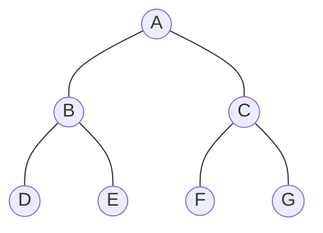

## 先导知识

### 树的相关知识点：

1. 结点的度：结点拥有的子树个数
2. 叶子：度数为0的结点
3. 孩子：结点子树的根
4. 双亲：孩子结点的上层结点
5. 结点层次：根节点算起，根为第一层，他的孩子为第二层
6. 树的深度：树的层数
7. 完全二叉树：深度为k，有n个结点的二叉树当且仅当其每一个结点都与深度为k的满二叉树中编号从1到n的结点一一对应时，称为完全二叉树
8. 满二叉树：如果一棵二叉树只有度为0的结点和度为2的结点，并且度为0的结点在同一层上，则这棵二叉树为满二叉树。

### 二叉树的性质：
1. 二叉树的第i层上至多有2^(i-1)（i≥1）个节点
2. 深度为h的二叉树中至多含有2h-1个节点
3. 若在任意一棵二叉树中，有n0个叶子节点，有n2个度为2的节点，则必有n0=n2+1
4. 具有n个节点的完全二叉树深为log2x+1（其中x表示不大于n的最大整数）
5. 对于编号为i（i≥1）的节点：当i=1时，该节点为根，它无双亲节点
6. 对于编号为i（i≥1）的节点：当i>1时，该节点的双亲节点的编号为i/2
## 二叉树的建立
二叉树的建立有多种方法，例如数组建立或者链式存储的方法建立，这里我们用最常规的链式存储建立一颗二叉树。
``` c++
#include<iostream>
using namespace std;
#define  ll long long
#define f(i,x,n) for(unsigned int i=x;i<=n;i++)
typedef struct BiTNode{
    char data;
    BiTNode *lchild,*rchild;
}BiTNode,*BiTree;
void Creat_BiTree(BiTree *T){
    char ch;
    cin>>ch;
    if(ch=='*')
        *T=NULL;
    else{
        *T=(BiTree)malloc(sizeof(BiTNode));
        (*T)->data=ch;
        Creat_BiTree(&(*T)->lchild);
        Creat_BiTree(&(*T)->rchild);
    }
}
//鍏堝簭閬嶅巻
void Front_Traverse(BiTree T){
    if(T==NULL)
        return;
    cout<<T->data<<" ";
    Front_Traverse(T->lchild);
    Front_Traverse(T->rchild);
}
//涓簭閬嶅巻
void Mid_Traverse(BiTree T){
    if(T==NULL)
        return;
    Mid_Traverse(T->lchild);
    cout<<T->data<<" ";
    Mid_Traverse(T->rchild);
}
//鍚庣画閬嶅巻
void Back_Traverse(BiTree T){
    if(T==NULL)
        return;
    Back_Traverse(T->lchild);
    Back_Traverse(T->rchild);
    cout<<T->data<<" ";
}
//灞傚簭閬嶅巻
void Floor_Traverse(BiTree T){
    queue<BiTree> q;
    q.push(T);
    while(!q.empty()){
        cout<<q.front()->data<<" ";
        if(q.front()->lchild!=NULL)
            q.push(q.front()->lchild);
        if(q.front()->rchild!=NULL)
            q.push(q.front()->rchild);
        q.pop();
    }
}
//鎵惧叡鍚岀鍏?
void Find_Parent(BiTree T){
    
}//A B D H * * I * * E * * C F * * G * *
int main(){//a b c d * * * * *
    BiTree p;
    Creat_BiTree(&p);
    cin>>a>>b;
    Back_Traverse(p);
    Find_Parent(p);
    return 0;
}
```

